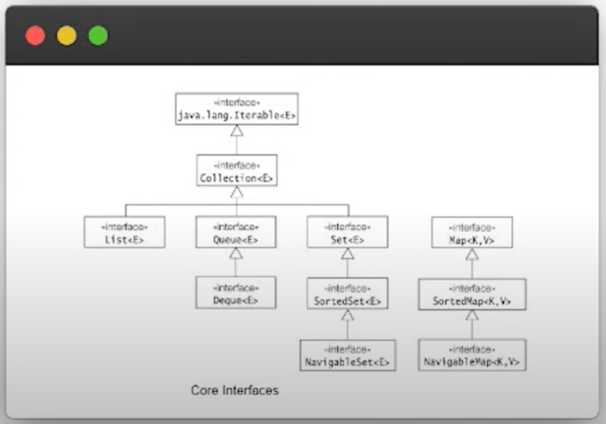
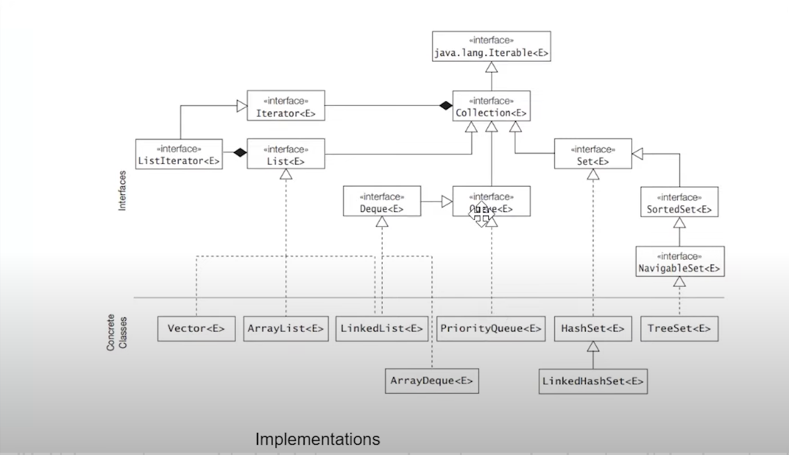
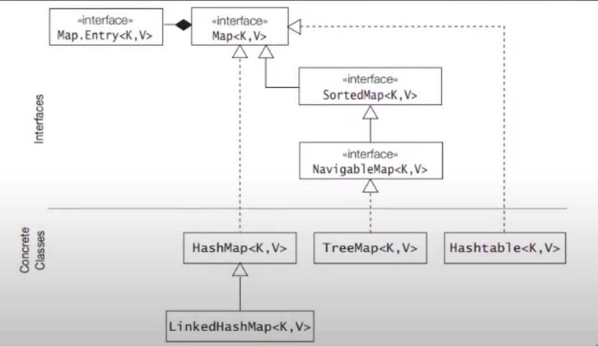

# INTRODUCTION
A collection allows a group of objects to be treated as a single unit. Java Collection Framework provides a set of standard utility classes for managing various kind of collections.
The core framework is provided in `java.util` package and comprises three main parts:
 1. The core interface
 2. A set of implementations (concrete classes) that are specific implementations of the core interface.
 3. Static Utility Methods found in Collections and Arrays classes that can be used to perform various operations on collections and arrays.

## Core Interfaces

## Concrete Class Implementations From Core Interfaces

## Map Concrete Class Implementation

## Iterable Interface
Now that we have seen the core interfaces and concrete class implementations of 
collection framework. Now starting its implementation, from the top interface that
is `Iterable`.
 
`OurGenericList<T>` is a generic class which contains a list and whenever we add a new 
element it is added to that list. But we can't iterate over it because, that list is 
private element of this class. So, to iterate over it we implement `Iterable<T>` interface,
this will make this class iterable. Now, this interface contains a method `iterator()`
which return `Iterator<T>` object.
Now, this `Iterator<T>` is returned by the inner class `OurGenericListIterator` which implements
`Iterator<T>` interface. This interface has two methods, `hasNext()` and `next()` these
in this interface we can access the variables of `Outer Class`, which is `OurGenericList<T>`,
so we can treat it as collection.

## Collection Interface
The Collection interface in Java is a fundamental interface that provides a unified way to work with groups of objects. It is part of the Java Collections Framework and serves as the root interface for most of the other collection interfaces like List, Set, and Queue.

Here are some key points about the Collection interface:

1. Purpose: 
The Collection interface represents a group of objects known as elements. It provides methods for adding, removing, and manipulating elements in a collection.

2. Structure:
The Collection interface does not enforce any specific order or indexing of elements. It is a generic interface that can work with any type of objects using type parameters.

3. Methods:
The Collection interface defines several methods to perform common operations on collections, such as adding elements, removing elements, checking for containment, iterating over elements, and more. Some of the commonly used methods include add, remove, contains, size, isEmpty, iterator, and toArray.

4. Inheritance:
The Collection interface extends the Iterable interface, which enables collections to be iterated using the enhanced for-loop or by explicitly obtaining an iterator.

5. Subinterfaces:
The Collection interface is the parent interface for more specialized collection interfaces like List, Set, and Queue. These subinterfaces provide additional behavior and semantics specific to different types of collections.

6. Implementations:
The Collection interface itself does not provide a concrete implementation. However, you can find various classes that implement the Collection interface, such as ArrayList, LinkedList, and HashSet.

By using the Collection interface, you can write more generic code that can work with different types of collections interchangeably. It provides a unified way to manipulate and process groups of objects, making it easier to work with collections of data in Java.

#### Abstract Methods in Collection Interface
Here is a list of some abstract methods defined in the Collection interface:

`boolean add(E element):` Adds the specified element to the collection.

`boolean remove(Object element):` Removes a single occurrence of the specified element from the collection, if it is present.

`boolean contains(Object element):` Returns true if the collection contains the specified element.

`boolean isEmpty():` Returns true if the collection contains no elements.

`int size():` Returns the number of elements in the collection.

`void clear():` Removes all elements from the collection.

`boolean addAll(Collection<? extends E> collection):` Adds all elements from the specified collection to the collection.

`boolean removeAll(Collection<?> collection):` Removes all elements from the collection that are also contained in the specified collection.

`boolean retainAll(Collection<?> collection):` Retains only the elements in the collection that are contained in the specified collection.

`boolean containsAll(Collection<?> collection):` Returns true if the collection contains all the elements in the specified collection.

`Object[] toArray():` Returns an array containing all the elements in the collection.

`Iterator<E> iterator():` Returns an iterator over the elements in the collection.

### List Interface
In Java, the List interface is a Sub-interface of the Collection interface. It represents an ordered collection of elements, allowing duplicate values and maintaining the insertion order. The List interface provides methods to add, remove, access, and manipulate elements in a list.

#### Class That Implements the List Interface
`ArrayList:` This class provides a resizable array implementation of the List interface. It is backed by an array and supports fast random access and dynamic resizing.

`LinkedList:` This class provides a doubly linked list implementation of the List interface. It is useful when frequent insertion and deletion operations are performed, but random access is slower compared to ArrayList.

`Vector:` This class is similar to ArrayList but is synchronized, making it thread-safe. It is part of the legacy Java Collections Framework and has been largely replaced by ArrayList.
   
### ArrayList vs LinkedList
1. Data Structure:
`ArrayList:` It uses a dynamic array to store the elements internally. The elements are stored in a contiguous block of memory, allowing for fast random access.
 
`LinkedList:` It uses a doubly linked list to store the elements internally. Each element is stored in a separate node, and the nodes are linked together, allowing for efficient insertion and deletion operations.

2. Performance:

`Random Access:` ArrayList provides fast random access to elements by index using the get() method. The time complexity for random access is O(1).
 
`Insertion/Deletion:` LinkedList performs better than ArrayList for frequent insertion and deletion operations, especially near the beginning or middle of the list. The time complexity for insertion/deletion is O(1) when performed at the beginning or end of the list. However, it requires traversing the list to find the insertion/deletion position, resulting in O(n) time complexity for operations in the middle of the list.
 
`Iteration:` ArrayList is generally faster for sequential access and iteration, as it provides efficient random access. LinkedList may be slower for iteration due to the need to traverse the list sequentially.

3. Memory Usage:

`ArrayList:` It consumes more memory compared to LinkedList because it needs to allocate a contiguous block of memory to store the elements.
 
`LinkedList:` It consumes less memory compared to ArrayList because it only needs to allocate memory for individual nodes.

4. Usage Scenarios:

`ArrayList:` It is suitable for scenarios where random access, such as retrieving elements by index, is frequent. It is also preferred when the list size is fixed or changes infrequently.
 
`LinkedList:` It is suitable for scenarios where frequent insertion and deletion operations are required, especially near the beginning or middle of the list. It is also useful when the list size can change dynamically.

## List Iterator
The `ListIterator interface` in Java provides more functionality than the Iterator interface for iterating over elements in a List in both forward and backward directions. It allows bidirectional traversal and enables you to modify elements during iteration. 
We can get its object using the `.listIterator()` method on the list interface objects, like, ArrayList, LinkedList, Vector.
 
 
Here are the key features and methods of the ListIterator interface:
 
 
`Bidirectional Iteration:`
 
The ListIterator allows you to traverse elements in both forward and backward directions.
It provides methods like hasNext() and next() for forward iteration, and hasPrevious() and previous() for backward iteration.
The nextIndex() and previousIndex() methods return the indexes of the next and previous elements, respectively.
 
 
`Element Modification:`
 
The ListIterator enables you to modify elements during iteration, unlike the basic Iterator.
It provides methods like set(E element) to replace the last element returned by next() or previous() with a new element.
The add(E element) method allows you to insert a new element immediately before the next element that would be returned by next().
 
 
`Cursor Position:`
 
The ListIterator maintains a cursor position that represents the position between elements in the list.
Initially, the cursor is positioned before the first element, and the first call to next() moves the cursor to the first element.
Similarly, initially, the cursor is positioned after the last element in the backward direction, and the first call to previous() moves the cursor to the last element.
The hasNext() and hasPrevious() methods determine if there are elements in the forward and backward directions, respectively.
 
 
`Removal of Elements:`
 
The ListIterator allows you to remove elements during iteration using the remove() method.
The remove() method removes the last element returned by next() or previous() from the underlying List.
 
 
`Additional Methods:`
 
The ListIterator provides additional methods like next() and previous() that return the next and previous elements, respectively, and advance the cursor.
The hasNext() and hasPrevious() methods check if there are elements available in the forward and backward directions.
The nextIndex() and previousIndex() methods return the indexes of the next and previous elements, respectively.
The ListIterator interface is implemented by classes that implement the List interface, such as ArrayList and LinkedList. It offers more control and flexibility for iterating over and modifying elements in a list compared to the basic Iterator interface.
 

It's important to note that not all lists support the ListIterator interface. For example, Arrays.asList() returns a fixed-size list that does not support modification operations or the ListIterator interface.
 

## Queue Interface
The Queue interface in Java is a sub-interface of the Collection interface. It represents a collection of elements with a specific order for processing, following the First-In-First-Out (FIFO) principle.

Key features of the Queue interface:

`Ordering:` The Queue interface maintains the order in which elements are added, allowing you to process them in the same order.
 
`Element Insertion:` Elements are inserted at the end of the queue using the add() or offer() methods. If the queue is bounded and reaches its capacity, the add() method throws an exception, while the offer() method returns a special value (usually false).
 
`Element Removal:` Elements are removed from the beginning of the queue using the remove() or poll() methods. If the queue is empty, the remove() method throws an exception, while the poll() method returns a special value (usually null).
 
`Inspection:` The Queue interface provides methods like element() and peek() to inspect the element at the beginning of the queue without removing it. If the queue is empty, the element() method throws an exception, while the peek() method returns a special value (usually null).

Common methods of the Queue interface:

`add(E element):` Inserts the specified element into the queue. Throws an exception if the queue is full.
 
`offer(E element):` Inserts the specified element into the queue. Returns true if successful, or false if the queue is full.
 
`remove():` Removes and returns the element at the beginning of the queue. Throws an exception if the queue is empty.
 
`poll():` Removes and returns the element at the beginning of the queue. Returns null if the queue is empty.
 
`element():` Retrieves, but does not remove, the element at the beginning of the queue. Throws an exception if the queue is empty.
 
`peek():` Retrieves, but does not remove, the element at the beginning of the queue. Returns null if the queue is empty.
 
`size():` Returns the number of elements in the queue.
 
`isEmpty():` Checks if the queue is empty.
The Queue interface provides a convenient way to work with collections that require FIFO processing, such as task scheduling, message queues, and more. It is implemented by various classes in Java's collection framework, including LinkedList and PriorityQueue.
#### Class That Implements the Queue Interface
`LinkedList:` LinkedList is a doubly-linked list implementation of the Queue interface. It provides efficient insertion and removal of elements at both ends of the list, making it suitable for implementing a queue.
 
`PriorityQueue:` PriorityQueue is an implementation of the Queue interface that provides priority-based ordering of elements. Elements are ordered based on their natural ordering or a custom comparator. The element with the highest priority is always at the head of the queue.
 
`ArrayDeque:` ArrayDeque is a resizable-array implementation of the Queue interface. It allows fast insertion and removal of elements at both ends of the deque. It can be used as both a queue and a stack.

The `PriorityQueue class` in Java is an implementation of the Queue interface that provides a priority-based ordering of elements. 
Elements in a PriorityQueue are ordered based on their natural ordering or a custom comparator if provided.

Here are some key points about the PriorityQueue class:

`Ordering:` The elements in a PriorityQueue are ordered either according to their natural ordering (if they implement the Comparable interface) or by a custom comparator provided during initialization.
 
`Priority-based removal:` The PriorityQueue allows efficient retrieval and removal of the highest-priority element. The element with the highest priority (as defined by the natural ordering or comparator) is always at the front of the queue and is the next element to be removed when calling methods like poll(), remove(), or peek().
 
`No random access:` Unlike List implementations, such as ArrayList or LinkedList, the PriorityQueue does not provide random access to its elements. You cannot access elements at arbitrary positions like get(index).
 
`Insertion complexity:` Adding an element to a PriorityQueue has a time complexity of O(log N), where N is the current number of elements in the queue. The underlying data structure of a PriorityQueue is a binary heap, which allows efficient insertion and removal of elements while maintaining the priority order.
 
`Not thread-safe:` PriorityQueue is not synchronized and is not thread-safe by default. If multiple threads access a PriorityQueue concurrently and modify it, external synchronization must be applied to ensure thread safety.

###### 1. To Implement Queue(FIFO) use LinkedList. 
###### 2. To Implement Stack(LIFO) use Stack Class.
###### 3. ArrayDeque is used to implement the bidirectional list, which can be used as `Stack` as well as `Queue`.
###### 4. ArrayDeque and LinkedList are implementing Dequeue Interface, so they have all the methods of `Queue` and `DeQueue` Interface

## Dequeue Interface
The `Deque` (Double Ended Queue) interface in Java represents a queue where elements can be inserted and removed from both ends. It extends the `Queue` interface and provides additional methods to support operations at both the head and tail of the queue.

Key features of the `Deque` interface:

1. Insertion and Removal: The `Deque` interface supports insertion and removal operations at both ends of the queue. Elements can be added or removed from the head (front) or tail (end) of the queue.

2. Double Ended: Unlike a regular queue, a `Deque` allows operations to be performed on both ends, making it suitable for use as both a queue and a stack.

3. Null Elements and Duplicates: Like other collection interfaces, a `Deque` can contain null elements and can also contain duplicate elements.

4. Ordering: Implementations of the `Deque` interface may or may not maintain a specific order of elements. Some implementations, such as `LinkedList`, preserve the order of insertion, while others, such as `ArrayDeque`, do not.

Common methods provided by the `Deque` interface:

- `addFirst(E e)`: Adds the specified element to the head of the deque.
- `addLast(E e)`: Adds the specified element to the tail of the deque.
- `offerFirst(E e)`: Inserts the specified element at the head of the deque.
- `offerLast(E e)`: Inserts the specified element at the tail of the deque.
- `removeFirst()`: Removes and returns the element at the head of the deque.
- `removeLast()`: Removes and returns the element at the tail of the deque.
- `pollFirst()`: Retrieves and removes the first element of the deque, or returns null if the deque is empty.
- `pollLast()`: Retrieves and removes the last element of the deque, or returns null if the deque is empty.
- `getFirst()`: Retrieves, but does not remove, the first element of the deque.
- `getLast()`: Retrieves, but does not remove, the last element of the deque.
- `peekFirst()`: Retrieves, but does not remove, the first element of the deque, or returns null if the deque is empty.
- `peekLast()`: Retrieves, but does not remove, the last element of the deque, or returns null if the deque is empty.

Implementations of the `Deque` interface include `LinkedList` and `ArrayDeque`. These implementations provide different performance characteristics and can be chosen based on specific requirements.

## Comparable interface and the Comparator interface 
The Comparable interface and the Comparator interface in Java are used for sorting and comparing objects. They provide different ways to define the comparison logic depending on the specific requirements of the application.
 
1. `Comparable Interface:`
The Comparable interface is a generic interface present in the java.lang package. It allows objects of a class to be compared with each other based on a natural ordering. The class implementing the Comparable interface must override the compareTo() method, which defines the comparison logic. The compareTo() method returns a negative integer, zero, or a positive integer depending on whether the current object is less than, equal to, or greater than the specified object, respectively.
The Comparable interface provides a natural ordering for objects and is commonly used for sorting collections of objects that have a natural order. For example, the String class in Java implements the Comparable interface, allowing strings to be sorted lexicographically.
2. `Comparator Interface:`
   The Comparator interface is also a generic interface present in the java.util package. It provides a way to define custom comparison logic for objects that do not implement the Comparable interface or when a different sorting order is desired. The Comparator interface defines the compare() method, which takes two objects as arguments and returns a negative integer, zero, or a positive integer to indicate the ordering.
   Unlike the Comparable interface, the Comparator interface allows multiple comparison strategies to be defined. It allows objects to be sorted based on different criteria or custom rules. Comparator implementations can be used to sort objects in various ways without modifying the original class.
   The Comparator interface is commonly used when sorting collections or arrays of objects, where the ordering logic needs to be specified separately from the objects being compared. It provides flexibility and allows sorting based on different attributes or properties of the objects.

## Set Interface
   
The `Set` interface in Java represents a collection of elements that cannot contain duplicate values. It is part of the Java Collections Framework and extends the `Collection` interface. The `Set` interface does not guarantee the order of its elements.

The `Set` interface declares the following methods:

1. `int size()`: Returns the number of elements in the set.
2. `boolean isEmpty()`: Returns `true` if the set is empty, `false` otherwise.
3. `boolean contains(Object element)`: Returns `true` if the set contains the specified element, `false` otherwise.
4. `boolean add(E element)`: Adds the specified element to the set if it is not already present. Returns `true` if the element was added, `false` otherwise.
5. `boolean remove(Object element)`: Removes the specified element from the set if it is present. Returns `true` if the element was removed, `false` otherwise.
6. `void clear()`: Removes all elements from the set.
7. `Iterator<E> iterator()`: Returns an iterator over the elements in the set.

The `Set` interface does not define any additional methods beyond those inherited from the `Collection` interface.

Some commonly used classes that implement the `Set` interface are:

1. `HashSet`: This class implements the `Set` interface using a hash table. It does not guarantee the order of its elements.
2. `TreeSet`: This class implements the `Set` interface using a self-balancing binary search tree (specifically, a red-black tree). It orders its elements based on their natural ordering or a custom comparator.
3. `LinkedHashSet`: This class implements the `Set` interface as a hash table with a linked list running through it. It maintains the insertion order of elements.
4. `EnumSet`: This class is a specialized implementation of the `Set` interface for use with enums. It provides compact and efficient representation of a set of enum values.
5. `ConcurrentSkipListSet`: This class implements the `Set` interface using a concurrent skip list data structure. It provides thread-safe concurrent access and maintains elements in sorted order.

These classes provide different implementations of the `Set` interface with varying characteristics such as ordering, uniqueness of elements, and performance trade-offs. You can choose the appropriate implementation based on your specific requirements.

### Interfaces Implementing Set Interface
`SortedSet` Interface:
- The `SortedSet` interface in Java Collections represents a set that maintains its elements in a sorted order.
- It extends the `Set` interface and introduces additional methods for working with sorted sets.
- As it is an interface, it cannot be instantiated directly. Instead, you can use its implementing classes like `TreeSet`.

Key Features of `SortedSet`:
1. Sorted Ordering: Elements in a `SortedSet` are stored in a sorted order based on their natural ordering or a custom comparator.

2. No Duplicate Elements: Like the `Set` interface, `SortedSet` does not allow duplicate elements. Each element in the set is unique.

3. SortedSet Operations: The `SortedSet` interface provides methods for performing operations specific to sorted sets, such as getting the first and last elements, getting subsets based on a range of values, and more.

`NavigableSet` Interface:
- The `NavigableSet` interface extends the `SortedSet` interface and provides additional navigation methods for working with sorted sets.
- It adds methods for navigating the set in both forward and backward directions, and for finding elements based on specific conditions.

Key Features of `NavigableSet`:
1. Navigation Methods: `NavigableSet` provides methods like `lower`, `floor`, `ceiling`, and `higher` for finding elements based on their position in the set.

2. Reverse Navigation: It also provides methods like `descendingIterator` and `descendingSet` to navigate the set in the reverse order.

3. Range Operations: `NavigableSet` offers methods like `subSet`, `headSet`, and `tailSet` for obtaining subsets of elements based on a range of values.

Implementing Classes:
- The most commonly used implementing class for both `SortedSet` and `NavigableSet` is `TreeSet`, which uses a self-balancing binary search tree to store the elements.

These interfaces and their implementing classes provide powerful mechanisms for working with sorted sets, allowing you to efficiently navigate, search, and manipulate elements in a sorted order.

## Map Interface
The `Map` interface in Java represents a collection of key-value pairs. It provides methods to manipulate and access the data stored in the map. Here are the important methods defined by the `Map` interface:

1. `int size()`: Returns the number of key-value pairs in the map.
2. `boolean isEmpty()`: Returns `true` if the map is empty, `false` otherwise.
3. `boolean containsKey(Object key)`: Returns `true` if the map contains the specified key, `false` otherwise.
4. `boolean containsValue(Object value)`: Returns `true` if the map contains the specified value, `false` otherwise.
5. `V get(Object key)`: Returns the value associated with the specified key, or `null` if the key is not found in the map.
6. `V put(K key, V value)`: Associates the specified value with the specified key in the map. If the key already exists, the previous value is replaced.
7. `V remove(Object key)`: Removes the key-value pair with the specified key from the map and returns the corresponding value.
8. `void putAll(Map<? extends K, ? extends V> m)`: Copies all the key-value pairs from the specified map to this map.
9. `void clear()`: Removes all the key-value pairs from the map.
10. `Set<K> keySet()`: Returns a `Set` containing all the keys in the map.
11. `Collection<V> values()`: Returns a `Collection` containing all the values in the map.
12. `Set<Map.Entry<K, V>> entrySet()`: Returns a `Set` containing all the key-value pairs (entries) in the map.

The `Map` interface also provides methods for bulk operations, such as `replaceAll()`, `putIfAbsent()`, `remove()` with key-value pair, and more.

It's important to note that the `Map` interface does not allow duplicate keys. Each key is associated with a unique value. Implementations of the `Map` interface, such as `HashMap`, `TreeMap`, and `LinkedHashMap`, provide different ways to store and retrieve the key-value pairs, depending on factors like performance, ordering, and uniqueness requirements.

Using the `Map` interface, you can perform various operations like adding, removing, updating, and retrieving key-value pairs efficiently based on the keys. It's a versatile interface that provides a flexible way to manage data in a key-value format.

### Classes Implementing Map Interface Directly OR Indirectly
Sure! Here are some commonly used concrete classes that provide a concrete implementation of the `Map` interface in Java:

1. HashMap:
   - `HashMap` is a widely used implementation of the `Map` interface.
   - It stores key-value pairs in an unordered manner, using hash codes and hash buckets for efficient lookup.
   - It allows `null` keys and values.
   - The order of elements in a `HashMap` is not guaranteed.

2. TreeMap:
   - `TreeMap` is an implementation of the `Map` interface that maintains the keys in a sorted order.
   - It uses a red-black tree data structure to store key-value pairs, which provides efficient searching, insertion, and deletion operations.
   - The elements are ordered based on their natural ordering or a custom comparator provided during initialization.

3. LinkedHashMap:
   - `LinkedHashMap` is an implementation of the `Map` interface that maintains the order of elements in which they were inserted.
   - It combines the features of a hash table and a linked list, providing fast lookup and iteration while preserving the insertion order.
   - It has slightly higher memory overhead compared to `HashMap` due to the additional linked list.

4. Hashtable:
   - `Hashtable` is synchronized implementation of the `Map` interface, which provides thread-safe operations.
   - It is similar to `HashMap` but provides synchronized methods, ensuring that multiple threads can safely access the map.
   - It does not allow `null` keys or values.

These concrete classes provide different characteristics and trade-offs in terms of performance, ordering, synchronization, and memory usage. You can choose the appropriate implementation based on your specific requirements for your application.

## SortedMap and NavigableMap Interfaces
The `SortedMap` and `NavigableMap` interfaces in Java are subinterfaces of the `Map` interface that provide additional functionality for maintaining keys in sorted order.

1. `SortedMap` Interface:
   - The `SortedMap` interface extends the `Map` interface and ensures that the keys in the map are sorted in ascending order according to their natural ordering or a specified comparator.
   - It defines methods for retrieving the first and last keys, getting a submap of a range of keys, and obtaining a set of keys in sorted order.
   - Some of the important methods of the `SortedMap` interface are `firstKey()`, `lastKey()`, `subMap()`, `headMap()`, and `tailMap()`.

2. `NavigableMap` Interface:
   - The `NavigableMap` interface extends the `SortedMap` interface and provides additional methods for navigation and retrieval of entries based on the keys.
   - It includes methods for finding the closest keys, getting the next or previous key, and retrieving key-value pairs using the floor, ceiling, lower, and higher keys.
   - The `NavigableMap` interface also defines methods for creating reverse views of the map and performing operations on entries based on their relative positions.
   - Some of the important methods of the `NavigableMap` interface are `ceilingEntry()`, `higherEntry()`, `floorEntry()`, `lowerEntry()`, `pollFirstEntry()`, `pollLastEntry()`, and `descendingMap()`.

Both `SortedMap` and `NavigableMap` interfaces are implemented by concrete classes in the Java Collections Framework. Examples of concrete classes that provide a sorted map implementation are `TreeMap` and `ConcurrentSkipListMap`.

By using the `SortedMap` and `NavigableMap` interfaces, you can store key-value pairs in sorted order and perform various operations based on the keys. These interfaces provide convenient methods for retrieving subsets of the map, navigating through the entries, and performing range-based operations on the keys.
